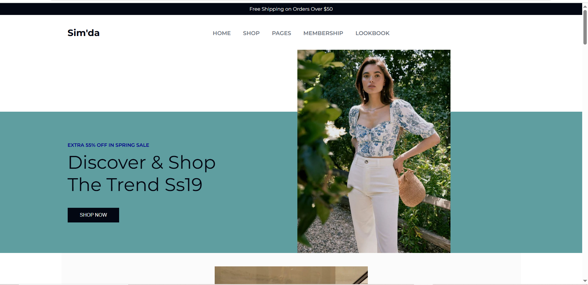
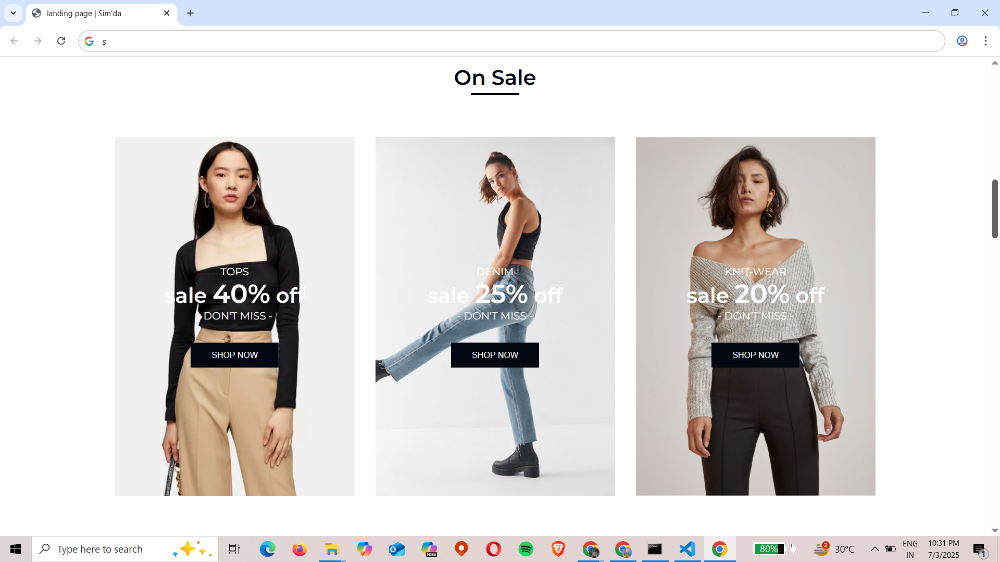
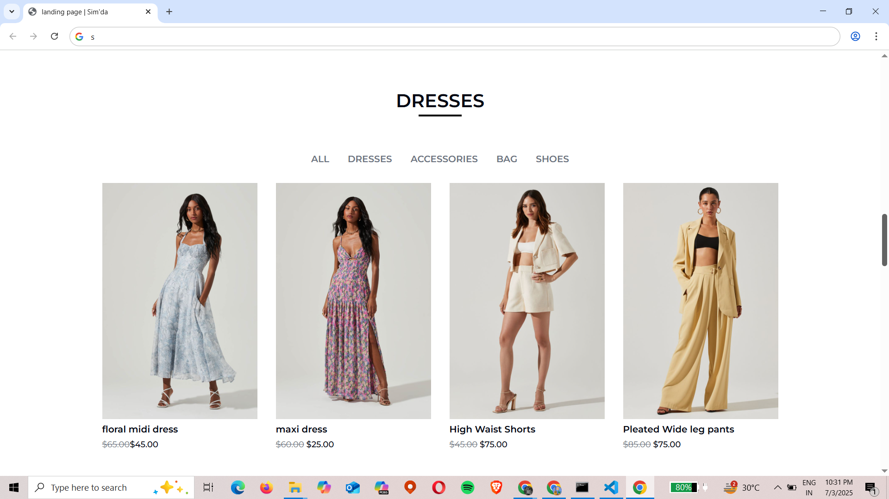
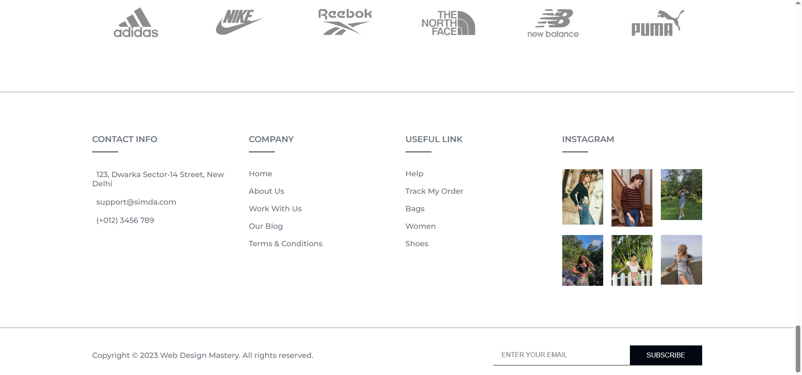

# 🛒 Shopping App Landing Page

This is a responsive landing page designed for a shopping app, built using HTML and CSS. The landing page highlights the app’s features, product sections, and a clear call-to-action to attract potential users.

## 🚀 Features

- Modern and clean UI
- Responsive design for desktop and mobile
- Attractive hero section with app highlights
- Featured product showcase
- Call-to-action button for download or shopping
- Contact or social media section

## 📸 Screenshots






## 🛠️ Tech Stack

- HTML5
- CSS3

## 💻 How to Run

1. Clone this repository:
   ```bash
   git clone https://github.com/simrandalal/Landing-Page.git
